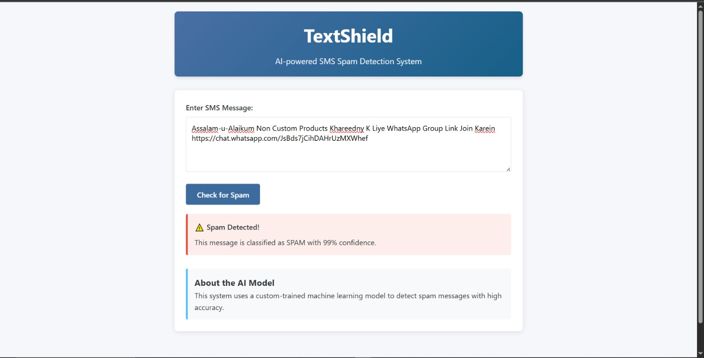

# 📱 TextShield — SMS Spam Classifier for Roman Urdu + English

**TextShield** is a machine learning-based SMS classification system that identifies messages as **Spam** or **Ham**, specifically designed to handle natural, bilingual messages written in **Roman Urdu and English**.

This repository contains the **core ML development** done in Google Colab, including data preparation, model experimentation, and export of trained models.

---

## 💡 Project Highlights

- Custom data collection & manual labeling
- Support for mixed-language (Roman Urdu + English) messages
- Comprehensive text preprocessing pipeline
- Feature extraction with:
  - Bag of Words
  - TF-IDF
- Evaluation of multiple ML models:
  - Logistic Regression
  - Naive Bayes
  - Random Forest
- Final model saved as `.pkl` for deployment

---

## 🧪 Model Development (Google Colab)

All processing was performed using a Colab notebook:  
📓 **TextShield_Model_Development.ipynb**

### Key Steps

- Load and label SMS dataset
- Clean and normalize bilingual text
- Vectorize using `CountVectorizer` and `TfidfVectorizer`
- Train multiple classifiers and compare accuracy
- Export best-performing model + vectorizer

---

---

## 🧠 Final Model Info

- **Vectorizer**: TF-IDF (unigram + bigram)
- **Classifier**: Logistic Regression
- **Test Accuracy**: ~90%
- **Overfitting/Underfitting**: No
- **Language Coverage**: Roman Urdu + English

---

## 👤 Maintainer

This repo reflects my core contributions to the **ML pipeline**, including:

- Data collection & annotation
- Model experimentation & optimization in Google Colab
- Saving models for deployment

---

## 📁 Files Included

textshield-ml/ 
├── TextShield_Model_Development.ipynb # Complete ML pipeline 
├── dataset.csv # Labeled bilingual SMS messages 
├── logistic_model.pkl # Final trained classifier 
├── vectorizer.pkl # TF-IDF vectorizer

---

## 🌐 Web Interface (Built on This Model)

The trained model and vectorizer from this repository were used in a full-stack web app:  
🔗 [View Web Interface on GitHub](https://github.com/Abdul-Diyan/Ai_project)

